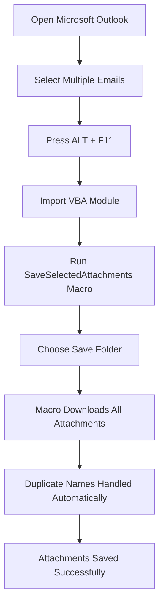

# Outlook Bulk Attachment Saver

Enterprise-grade Microsoft Outlook VBA macro for bulk saving email attachments safely and efficiently.

---

# Overview

This Outlook VBA automation tool allows you to:

- Select hundreds of emails at once
- Download all attachments automatically
- Avoid duplicate filename conflicts
- Skip signature/logo images
- Save hours of repetitive manual work

Perfect for:

- Engineering companies
- EPC workflows
- Procurement teams
- Vendor documentation handling
- Daily Outlook-heavy operations

---

# Visual Workflow



---

# Features

- Bulk-save attachments from multiple selected Outlook emails
- Duplicate filename handling
- Illegal filename sanitization
- Inline/signature image skipping
- OLE attachment filtering
- MAX_PATH protection
- Outlook UI responsiveness optimization
- Defensive error handling
- COM object cleanup
- Performance optimized batch processing

---

# Why This Project Exists

Saving Outlook attachments one email at a time is extremely repetitive and time consuming.

This VBA automation tool was built to:

- reduce repetitive work
- save engineering/admin teams hours of manual effort
- improve productivity
- automate attachment extraction safely

Especially useful for:

- EPC companies
- engineering teams
- procurement teams
- documentation teams
- project management workflows
- vendor document handling

---

# Step-by-Step Tutorial

## Step 1 — Open Outlook VBA Editor

Open Microsoft Outlook.

Press:

```text
ALT + F11
```

This opens the VBA editor.

---

## Step 2 — Import VBA Module

Inside VBA editor:

- Click:

```text
File → Import File
```

- Select:

```text
SaveSelectedAttachments.bas
```

from the repository.

---

## Step 3 — Save VBA Project

Press:

```text
CTRL + S
```

to save the VBA project.

---

## Step 4 — Select Outlook Emails

Go back to Outlook.

Now:

- Select one or many emails
- Use CTRL or SHIFT for mass selection
- Can process large batches together

---

## Step 5 — Run Macro

Inside Outlook:

- Press:

```text
ALT + F8
```

- Select:

```text
SaveSelectedAttachments
```

- Click Run

---

## Step 6 — Choose Download Folder

A folder browser window will appear.

Select where attachments should be saved.

Example:

```text
D:\Outlook Attachments\
```

---

## Step 7 — Automatic Bulk Download

The macro now automatically:

- downloads all attachments
- skips inline signature images
- avoids duplicate filenames
- sanitizes illegal Windows characters
- protects against invalid long paths

---

# Example Use Case

Instead of manually:

- opening 100 emails
- downloading attachments one-by-one
- renaming duplicates manually

This macro completes everything automatically in one run.

---

# Folder Structure Example

```text
Outlook Attachments/
│
├── VendorQuotation.pdf
├── PipingLayout_1.dwg
├── MOM_Meeting.pdf
├── Datasheet.xlsx
└── TechnicalBid.docx
```

---

# Compatibility

- Microsoft Outlook Desktop
- Outlook 2016+
- Microsoft 365 Outlook
- Windows

---

# Performance Optimizations

This project includes:

- throttled DoEvents optimization
- duplicate filename handling
- MAX_PATH protection
- COM object cleanup
- defensive error handling
- inline image filtering

Designed for stable large-batch Outlook processing.

---

# Planned Future Enhancements

- Sender-based folder sorting
- Date-wise folder organization
- CSV logging
- Duplicate hash checking
- ZIP extraction
- Ribbon button integration
- Silent mode
- Progress bar
- Power Automate integration

---

# License

MIT License

---

# Author

Akshay Solanki

GitHub:
https://github.com/akshayai1996
